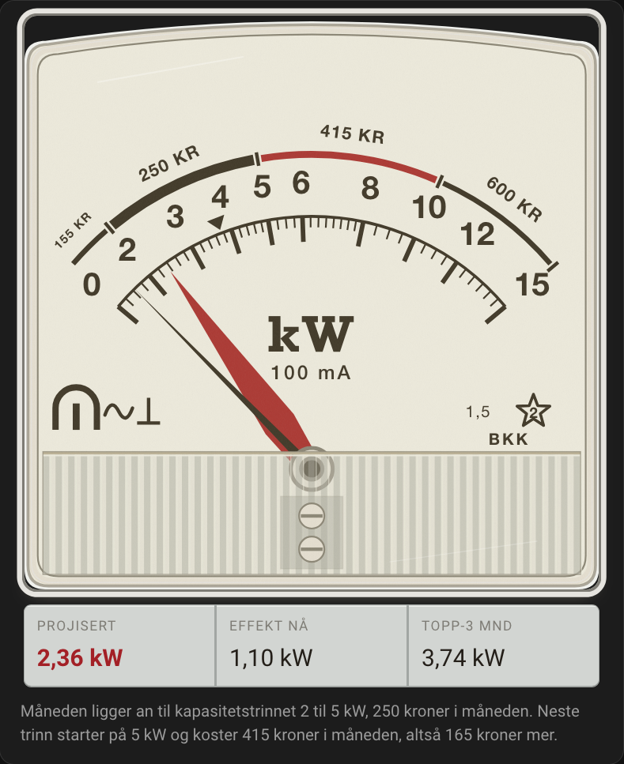
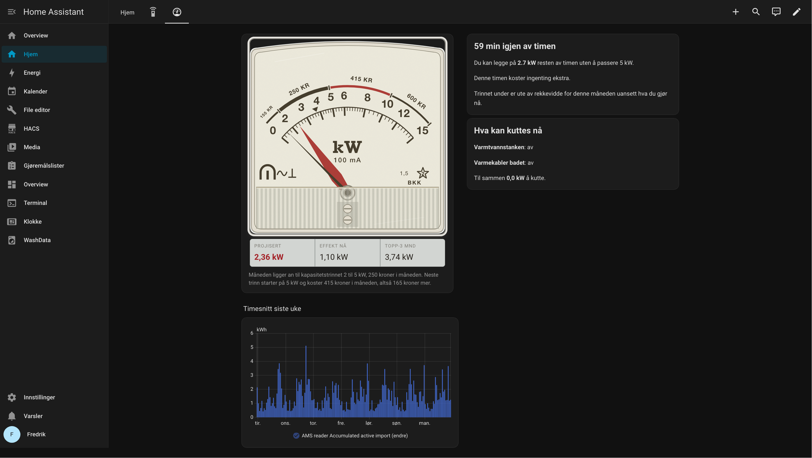
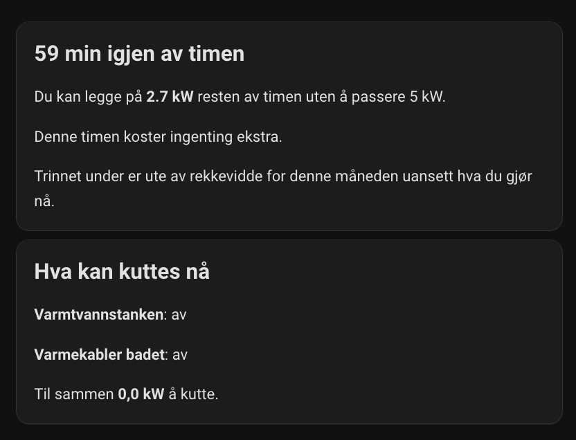
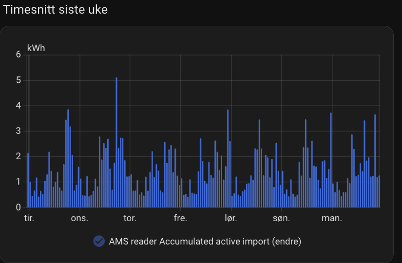

# Effektvakt

  
  
  
  

Effektvakt regner ut hvor høyt time-snittet ditt ender, og sier fra i tide hvis timen er på vei til å dytte deg opp i et dyrere kapasitetstrinn i nettleien. Integrasjon for Home Assistant, laget for norske strømkunder.

  

## Hvordan det virker

Norske nettselskap fakturerer kapasitetsleddet etter snittet av de tre høyeste time-snittene fra ulike dager i måneden (NVE-modellen). Drar én time snittet av de tre over neste terskel, betaler du det høyere trinnet for hele måneden, uansett hvor lite du bruker resten av tiden.

Motsatt vei gjelder også: er dagens topp allerede blant de tre høyeste, koster en ny time på samme nivå ingenting.

Effektvakt leser power- og energy-sensoren din hvert 15-60 sekund og projiserer hva time-snittet blir ved time-slutt, ut fra hva som er brukt så langt og hva som brukes akkurat nå. Marginen måles mot terskelen for neste trinn, justert for hvilke av topp-3-dagene som allerede er registrert denne måneden. Risiko-nivået har hysterese, så en kortvarig dipp slår ikke lasten av og på igjen med det samme.

## Hva du får

- Projisert time-snitt, margin til neste trinn og topp-3-snitt for måneden, som sensorer
- Risiko for neste trinn (god margin, nærmer seg, like under, over terskelen) og en binary sensor som automations kan trigge på
- Anslag på hvor mye du faktisk har å kutte, etter valgt strategi
- Fire blueprints for varmtvannsbereder, panelovner og varsler
- Et Lovelace-kort som tegner skiven fra dine egne kapasitetstrinn
- Watchdog som setter sensorene til `unknown` hvis coordinatoren henger

## Installasjon

Legg til repoet som custom repository i HACS, `fredrik-lindseth/hacs-effektvakt` med kategori **Integration**, klikk **Download** og start Home Assistant på nytt. Manuelt gjøres det samme ved å kopiere `custom_components/effektvakt` til `/config/custom_components/`.

Deretter **Settings > Devices & Services > Add Integration > Effektvakt**. Du velger nettselskap, peker på power-sensoren din, og resten har standardverdier som duger. Stegene er beskrevet i [docs/oppsett.md](docs/oppsett.md).

## Dashbord

Integrasjonen har med et eget Lovelace-kort som gjenskaper de gamle analoge effektvaktene som hang i norske sikringsskap. Skiven tegnes fra dine egne kapasitetstrinn, så kronebeløpene på buen er prisene ditt nettselskap faktisk tar.

  

Rød viser er projisert time-snitt, den tynne svarte er effekten akkurat nå, og trekanten utenfor buen er topp-3-snittet for måneden. Den går aldri ned igjen, for det er den du kommer til å betale for uansett hva du gjør resten av måneden.

Kortene ved siden av svarer på det du faktisk lurer på:

  

Og ukesgrafen viser de faktiske timesnittene, altså tallene nettselskapet fakturerer etter:

  

Se [docs/dashboard-kort.md](docs/dashboard-kort.md) for oppsett, stiler og full forklaring av merkene på skiven.

## Dokumentasjon

| Dokument                                           | Innhold                            |
| -------------------------------------------------- | ---------------------------------- |
| [docs/oppsett.md](docs/oppsett.md)                 | Konfigurasjonsflyten steg for steg |
| [docs/sensorer.md](docs/sensorer.md)               | Alle sensorer og attributter       |
| [docs/beregninger.md](docs/beregninger.md)         | Formler og beregningslogikk        |
| [docs/input-sensorer.md](docs/input-sensorer.md)   | Sensorkrav og kjente kilder        |
| [docs/strategi.md](docs/strategi.md)               | Kutt-strategier sammenlignet       |
| [docs/blueprints.md](docs/blueprints.md)           | Import, input og eksempler         |
| [docs/dashboard-kort.md](docs/dashboard-kort.md)   | Lovelace-kortet                    |
| [docs/fysisk-panel.md](docs/fysisk-panel.md)       | ESP32-panel, skisse (ikke bygget)  |
| [docs/begrensninger.md](docs/begrensninger.md)     | Kjente begrensninger               |
| [docs/dso.md](docs/dso.md)                         | DSO-data og oppdatering            |
| [docs/development.md](docs/development.md)         | Utvikler-guide                     |
| [docs/faq.md](docs/faq.md)                         | Ofte stilte spørsmål               |

## Lisens

MIT. Se [LICENSE](LICENSE).
